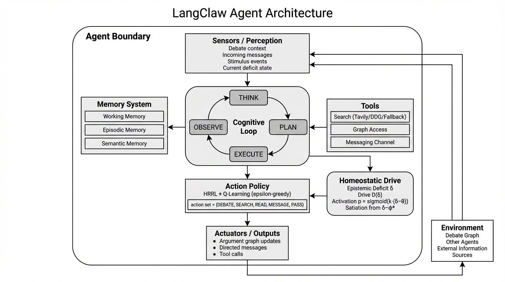
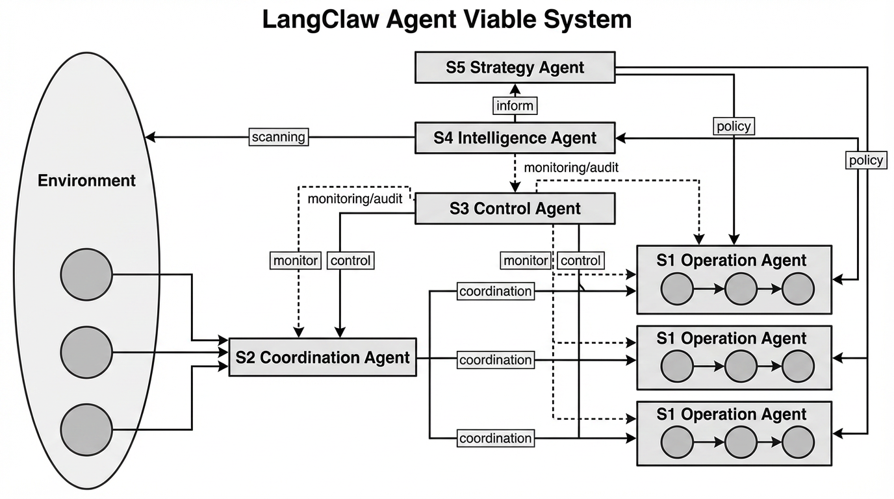

# Driveplexity — Endogenous Activation via Homeostasis in Multi-Agent LLM Debate

> Experimental framework that contrasts **endogenous homeostatic
> activation (Driveplexity)** against **exogenous orchestration
> (LangGraph router)** in adversarial, zero-sum LLM debates.
>
> This repository contains the codebase, reproducibility tooling and
> LaTeX source of the paper submitted to **JAIIO 2026** (ASAID Track).
> The full-length draft lives in `paper_jaiio.tex`; the 4-page short
> version submitted to the conference is `paper_jaiio_short.tex`
> (`paper_jaiio_short.pdf`).

---

> **Note on naming.** The Python package directory is still named
> `langclaw/` for historical reasons (the project's internal codename
> during development). It is the implementation of the **Driveplexity**
> framework described in the paper, and renaming the folder would break
> imports across logs, checkpoints and analysis scripts. Treat
> `langclaw/` and *Driveplexity* as referring to the same artefact
> throughout this repo.

---

## Table of contents

1. [What this is](#1-what-this-is)
2. [Repository layout](#2-repository-layout)
3. [Quick start (local)](#3-quick-start-local)
4. [Quick start (Docker)](#4-quick-start-docker)
5. [Reproducing the paper end-to-end](#5-reproducing-the-paper-end-to-end)
6. [Seeds, calibration and orchestration modes](#6-seeds-calibration-and-orchestration-modes)
7. [Output files](#7-output-files)
8. [Recovery, checkpoints and watchdog](#8-recovery-checkpoints-and-watchdog)
9. [Dashboard](#9-dashboard)
10. [Compiling the paper](#10-compiling-the-paper)
11. [Troubleshooting](#11-troubleshooting)
12. [AI tooling disclosure](#12-ai-tooling-disclosure)
13. [Citation](#13-citation)
14. [License](#14-license)

---

## 1. What this is

**Driveplexity (DPLXY)** is a Multi-Agent System (MAS) of **10 LLM
agents** organised in two opposing factions of 5. Inside each faction
every agent maps to one of the five subsystems of the Viable System
Model (S1–S5), used here as a minimal social-organisation unit.

Each agent runs an event-driven `THINK → PLAN → EXECUTE → OBSERVE`
cognitive loop and can perform `DEBATE`, `SEARCH`, `READ`, `MESSAGE`
or `PASS` actions, plus directed FIPA-like messaging (`request`,
`inform`, `propose`, `confirm`, `query`).

Two activation strategies are compared **under matched temporal budgets**
(same number of heartbeats, same per-agent capabilities, same memory
infrastructure):

- **Driveplexity / DPLXY (proposed).** Each agent owns an *epistemic
  deficit* `δ_i` that drifts upward during inactivity and is reduced
  after a useful contribution. A sigmoid gate over `δ_i` turns the
  drive into activation probability; reward comes from a Δφ\* proxy
  defined over an Abstract Argumentation Framework. A linear TD(0)
  Q-learner is added as an *experimental extension* whose convergence
  remains an open question (deadly-triad regime).
- **LangGraph (baseline).** A deterministic graph router fires agents
  exogenously, with the same per-agent action set.

The framework is grounded on three ontological axioms of autonomy
(**AAH, A1–A3**: autonomy, drive, quality gate) that state the
minimal commitments the design makes. The HRRL tradition
(Keramati & Gutkin, 2014) is used only as the *theoretical
antecedent* that inspired the drive formulation; the measured system
is Driveplexity, not a vanilla HRRL port.

The scientific question is whether endogenous regulation prevents
**context collapse** — the loss of dialectical coherence over
extended interaction — more robustly than static routing in zero-sum
deliberation.

Two control conditions guard against the most obvious alternative
readings:

- **DPLXY-no-Q** — disables the TD(0) Q-learner while keeping the
  homeostatic closure, isolating the effect of regulation from
  learning.
- **LangGraph-informed** — hands the exogenous router the same
  structural features and `δ_i` that DPLXY uses internally, via
  JSON; isolates endogenous-vs-exogenous from informed-vs-uninformed.

### 1.1. Architecture at a glance

**Single-agent architecture.** Each agent closes a perception →
cognition → action loop around a homeostatic drive. The epistemic
deficit `δ_i` is fed by sensors and updated by satiation; the
sigmoid gate over `δ_i` turns it into activation probability; an
optional TD(0) Q-learner shapes action selection within the
cognitive loop.



**Faction-level organisation (VSM).** Inside each faction the five
agents map onto the five subsystems of Beer's Viable System Model
(S1 operation, S2 coordination, S3 control, S4 intelligence, S5
strategy). VSM is used here as a minimal viable social-organisation
unit, not as an empirical claim about VSM itself.



---

## 2. Repository layout

```text
driveplexity/
├── langclaw/                   # Python package implementing Driveplexity
│   ├── homeostasis.py          # Epistemic drive: decay, sigmoid gate, satiation
│   ├── q_learner.py            # Online linear TD(0) with normalisation + clipping
│   ├── delp_graph.py           # Argument graph (AAF) + Φ* proxy
│   ├── agent.py                # Agent loop, prompts, FIPA messaging
│   ├── simulation.py           # Environment, both orchestration modes
│   ├── langgraph_flow.py       # LangGraph baseline router
│   ├── router.py               # Inter-agent message routing
│   ├── router_informed.py      # LangGraph-informed fair-baseline router
│   ├── memory.py               # Three-layer memory (episodic/semantic/working)
│   ├── budget.py               # Hard / soft API rate limits
│   ├── actions.py              # Action utilities, StimulusEvaluator, search fallback
│   ├── core_metric.py          # CORE temporal coherence metric
│   ├── metrics.py              # PRR_G, IR, AAF acceptance, slopes
│   ├── events.py               # Tick/argument/shutdown events
│   ├── schemas.py              # Pydantic logging schemas
│   └── seeds.py                # Deterministic prime-seed factory
├── benchmark.py                # Multi-seed benchmark (DPLXY vs LangGraph)
├── run_ablation.py             # Ablation runner (DPLXY-no-Q, LG-informed)
├── calibrate_hyperparams.py    # Micro-simulation hyperparameter calibration
├── run_full_experiment.py      # Detached supervisor with watchdog
├── final_runner.py             # Watchdog auto-restart loop
├── auto_monitor.py             # Lightweight progress monitor
├── dashboard.py                # Streamlit live dashboard
├── main.py                     # Single-mode CLI entry
├── tools/
│   ├── volume_matched_analysis.py  # first-K / last-K volume-matched control
│   ├── agent_stats.py              # per-agent share / distribution stats
│   └── ahp_weights.py              # AHP weights for the LLM-as-judge rubric
├── paper_jaiio.tex             # Full paper (LNCS class)
├── paper_jaiio_short.tex       # 4-page JAIIO short version (submitted)
├── references.bib              # Bibliography (Biber / BibLaTeX APA)
├── llncs.cls / splncs04.bst    # LNCS document class
├── guide/                      # Authoring guide, review PDFs, LNCS templates
├── docs/                       # Supplementary docs (architecture, theory, etc.)
├── Dockerfile                  # Reproducible image (python:3.11-slim)
├── docker-compose.yml          # One-command full run inside container
├── requirements.txt            # Pinned Python dependencies
├── .env.example                # Template for required environment variables
└── EXPERIMENT_SUMMARY.md       # Concise experiment summary
```

---

## 3. Quick start (local)

Tested on Python 3.11 on Windows 10 PowerShell and Linux. Other 3.11.x
patches should also work.

```powershell
# 1) Create and activate a virtual environment
python -m venv .venv
.\.venv\Scripts\Activate.ps1     # PowerShell
# source .venv/bin/activate      # bash/zsh

# 2) Install pinned dependencies
pip install -r requirements.txt

# 3) Configure secrets
copy .env.example .env           # cp .env.example .env on Linux
# edit .env and set OPEN_AI_API_KEY (required) and TAVILY_API_KEY (optional)

# 4) Sanity check (very small run, ~2-3 minutes)
python benchmark.py --preflight --preflight-ticks 4 --seeds 7

# 5) Real benchmark for one seed pair (DPLXY + LangGraph)
python benchmark.py --iterations 80 --seeds 7 --modes hrrl langgraph
```

> The `--modes hrrl` flag name is kept for backward compatibility with
> existing logs and checkpoints. It activates the Driveplexity
> endogenous strategy.

Results land under `benchmark_results/` (or wherever `--output-dir`
points).

---

## 4. Quick start (Docker)

The provided `Dockerfile` ships a self-contained `python:3.11-slim`
image with all pinned dependencies. `docker-compose.yml` mounts the
repo into `/app`, so checkpoints, logs and outputs persist on the
host.

```bash
# Build the image once
docker build -t driveplexity:latest .

# Run the full experiment (calibration + 5-seed benchmark)
# Requires .env with OPEN_AI_API_KEY in the project root
docker compose up --build
```

Notes:

- The container runs in the foreground; use `docker compose up -d` for
  detached mode, or rely on the in-process watchdog (Section 8).
- Set `OPEN_AI_API_KEY` in `.env` *before* `docker compose up`; the
  file is loaded via `env_file:` and is **not** baked into the image.
- The default command in `docker-compose.yml` mirrors the canonical
  paper configuration (`--iterations 80 --seeds 7 17 99 123 256`,
  hard API limit 500, output dir `benchmark_results_v7`).

---

## 5. Reproducing the paper end-to-end

The short paper reports preliminary results for the evaluation seed
set **{7, 17, 99, 123, 256}**. Seed **42** was used only for *a
priori* hyperparameter calibration and is explicitly **excluded from
evaluation** to prevent calibration leakage.

Two ablation conditions complete the design:

- `DPLXY-no-Q` (`n = 1`) — `hrrl` mode with the Q-learner disabled.
- `LangGraph-informed` (`n = 2`) — `langgraph` mode with the router
  receiving the same structural features and `δ_i` as DPLXY.

### 5.1. One-shot supervisor (recommended)

`run_full_experiment.py` chains calibration → benchmark under a
resilient process with checkpointing and a watchdog:

```powershell
python run_full_experiment.py --detach `
  --project-root . `
  --calibration-ticks 10 `
  --calibration-seed 42 `
  --calibration-api-hard-limit 200 `
  --iterations 80 `
  --seeds 7 17 99 123 256 `
  --benchmark-api-hard-limit 500 `
  --benchmark-output-dir benchmark_results_v7 `
  --status-file experiment_status.json `
  --log-file experiment_run.log `
  --events-file experiment_events.jsonl `
  --state-file experiment_state.txt `
  --log-level WARNING
```

`--detach` spawns the worker as a background process with
`PYTHONIOENCODING=utf-8`, releases the parent shell, and immediately
returns the worker PID.

Inspect progress at any time:

```powershell
python run_full_experiment.py --status
Get-Content .\experiment_state.txt
Get-Content .\experiment_events.jsonl -Tail 20
Get-Content .\experiment_run.log -Tail 60
```

### 5.2. Reproduction only (skip calibration)

If you trust the released `calibration_results.json`, skip the
supervisor and run the benchmark directly:

```bash
python benchmark.py \
  --iterations 80 \
  --seeds 7 17 99 123 256 \
  --modes hrrl langgraph \
  --config calibration_results.json \
  --api-hard-limit 500 \
  --output-dir benchmark_results_v7
```

### 5.3. Ablations and fair baseline

```bash
# DPLXY-no-Q
python run_ablation.py --variant no_q \
  --seeds 7 --iterations 80 \
  --output-dir benchmark_results_v7_ablation

# LangGraph-informed
python run_ablation.py --variant langgraph_informed \
  --seeds 7 17 --iterations 80 \
  --output-dir benchmark_results_v7_fairbaseline
```

### 5.4. Volume-matched analysis

Addresses the confound that DPLXY produces more debates per heartbeat
than LangGraph (by design — endogenous drive fires when `δ_i`
justifies it). The analysis truncates DPLXY to `K = N_LG` debates
per seed, in two windows:

- **vm-1** — first `K` debates (short context).
- **vm-ℓ** — last `K` debates (context volume comparable to LangGraph).

```bash
python tools/volume_matched_analysis.py \
  --seeds 7 17 99 123 256 \
  --logs-dir benchmark_results_v7
```

Outputs `volume_matched_results.csv` and `volume_matched_summary.json`
under `tools/`.

Expected wall-clock time on a typical laptop with default OpenAI rate
limits is **≈4–6 hours per (mode, seed) pair**, dominated by API
latency.

---

## 6. Seeds, calibration and orchestration modes

### Seeds

The canonical paper evaluation seed set is `{7, 17, 99, 123, 256}`
(declared in `langclaw/seeds.py`). Every random source — Python
`random`, `numpy`, LLM sampling salt, agent-id assignment — is
derived deterministically from a master seed via `seeds.py`. Seed
`42` is kept separate, exclusively for hyperparameter calibration.

Re-running with the same seed and the same `requirements.txt`
reproduces the same trajectory modulo OpenAI non-determinism
(temperature `> 0` is the only remaining source of stochasticity).

### Calibration

`calibrate_hyperparams.py` runs an ablation micro-simulation that
sweeps key hyperparameters (`λ`, `θ`, `α`, `k`, Q-learner `α_q`, `γ`,
ε-greedy) and writes the chosen values to `calibration_results.json`.
The canonical paper run used:

```bash
python calibrate_hyperparams.py \
  --ticks 10 \
  --seed 42 \
  --api-hard-limit 200
```

The `--config calibration_results.json` flag of `benchmark.py` then
loads the calibrated hyperparameters automatically. Two *a priori*
criteria fix the selection — debate density in the operating range
and deficit stability around the set-point `ε` — and the values are
frozen across all evaluation seeds so that no comparison benefits
from a post-hoc retune.

### Orchestration modes

`benchmark.py --modes` accepts `hrrl`, `langgraph`, `round-robin`,
`random`. The paper contrasts `hrrl` (Driveplexity) against
`langgraph`; `round-robin` and `random` are kept as sanity-check
baselines.

| mode          | activation source                | budget per run             |
|---------------|----------------------------------|----------------------------|
| `hrrl`        | endogenous (sigmoid over `δ_i`)  | `--iterations` heartbeats  |
| `langgraph`   | exogenous deterministic router   | same heartbeat budget      |
| `round-robin` | every agent each tick            | sanity baseline            |
| `random`      | one random agent per tick        | sanity baseline            |

---

## 7. Output files

Each `(mode, seed)` pair produces, under `--output-dir`:

- `results_<mode>__seed<N>.json` — aggregated metrics for that run
  (debates, AAF acceptance, PRR\_G, IR, CORE, Δφ\* slopes, deliberative
  density, mean reward, …).
- `logs_<mode>__seed<N>.json` — per-tick events and per-agent
  trajectories (deficit, action, message routing).
- `run_checkpoints/<mode>__seed<N>.json` — per-tick checkpoint that
  enables `--resume`-style restart on the same run.
- `health_reports/<mode>__seed<N>.md` — automated post-run health
  report; if a red flag is raised, an LLM-generated explanation is
  appended.
- `preflight/` — outputs of `--preflight` runs (used to validate the
  full configuration before committing to a long run).

Aggregated results across seeds also produce comparison HTML charts
(`*_comparison.html`) when the dashboard or `benchmark.py` finishes a
multi-seed sweep.

---

## 8. Recovery, checkpoints and watchdog

Driveplexity was built to survive interrupted long runs (overnight,
power outages, API rate limits). Three layers cooperate:

1. **Per-tick checkpointing** in both `calibrate_hyperparams.py` and
   `benchmark.py`. Restart with the same command after a crash to
   resume from the last completed tick. Use `--clean` to *discard* the
   checkpoint and start fresh.
2. **Explicit run states** written by `run_full_experiment.py` to
   `--state-file`:
   - `RUNNING` — worker is healthy.
   - `PAUSED_RATE_LIMIT` — OpenAI 429; resume by re-running the same
     command after quota recovery.
   - `FAILED` — terminal error; check `--log-file` and
     `health_reports/`.
   - `COMPLETED` — all `(mode, seed)` pairs finished.
3. **Watchdog auto-restart** — `final_runner.py` polls the worker PID
   and the state file; if the worker dies in a recoverable state it is
   relaunched. Engage with:

   ```powershell
   python run_full_experiment.py --watchdog-loop --watchdog-interval 600
   ```

   `--watchdog-check` performs a one-shot check (good for cron / Task
   Scheduler).

Special exit codes the supervisor recognises:

| code | meaning                                                 |
|------|---------------------------------------------------------|
| 0    | Clean completion                                        |
| 75   | Rate limit — pause and resume on next launch            |
| 86   | Critical health flag — manual review required           |

---

## 9. Dashboard

A Streamlit dashboard renders live (or post-hoc) metrics:

```bash
python -m streamlit run dashboard.py
```

It reads from the most recent `--output-dir` and auto-refreshes while
the benchmark is running.

---

## 10. Compiling the paper

The paper uses LNCS (`llncs.cls` + `splncs04.bst`) and BibLaTeX with
Biber. The convenience script `_build_pdf.bat` chains the three
required passes:

```powershell
.\_build_pdf.bat                  # builds paper_jaiio.pdf
```

For the 4-page short version:

```bash
pdflatex paper_jaiio_short.tex
biber paper_jaiio_short
pdflatex paper_jaiio_short.tex
pdflatex paper_jaiio_short.tex
```

Both builds also work via TeX Live in the Docker image if you install
`texlive-full` on top.

---

## 11. Troubleshooting

| symptom                                          | likely cause / fix                                                                                                                                                       |
|--------------------------------------------------|-------------------------------------------------------------------------------------------------------------------------------------------------------------------------|
| `openai.AuthenticationError`                     | `.env` missing or `OPEN_AI_API_KEY` empty; copy from `.env.example` and re-run.                                                                                          |
| HTTP 429 from OpenAI                             | Worker pauses with state `PAUSED_RATE_LIMIT`; wait for quota and re-run the same command — checkpoints resume automatically.                                              |
| `UnicodeEncodeError` on Windows                  | Run with `PYTHONIOENCODING=utf-8` and `PYTHONUTF8=1`. The supervisor sets these for detached workers; for ad-hoc shells, `chcp 65001` helps.                              |
| Empty `_graph.html`                              | The argument graph hadn't accumulated nodes yet; finish at least 5 ticks before opening the dashboard.                                                                    |
| Watchdog keeps restarting                        | Inspect `experiment_run.log` and `health_reports/*.md`. If the run state is `FAILED`, the watchdog stops restarting (only `PAUSED_RATE_LIMIT` triggers auto-relaunch).   |
| Stale checkpoint after code change               | Pass `--clean` to `benchmark.py` or `calibrate_hyperparams.py` to discard the checkpoint deliberately.                                                                    |
| `tavily` errors when offline                     | Leave `TAVILY_API_KEY` empty; the SEARCH action falls back to a deterministic in-memory pool.                                                                             |

---

## 12. AI tooling disclosure

In line with the JAIIO 2026 Code of Conduct, the following AI tools
were used **as assistants under continuous human supervision and
review**. The authors retain full responsibility for the published
content.

| tool                                                    | role in this work                                                    |
|---------------------------------------------------------|----------------------------------------------------------------------|
| **GPT-5.4** (OpenAI)                                    | Manuscript redaction and language polishing                          |
| **Cursor + Claude Opus 4.7** / **Claude Code Opus 4.7** | Code authoring, refactoring and debugging assistance                 |
| **Perplexity Pro**                                      | Bibliographic research assistance                                    |
| **Figurelabs.ai**                                       | Diagram and illustration drafting                                    |
| **AI Reviewer 3**                                       | Adversarial peer-review of the manuscript (reviewer-style critique)  |
| **GPT-5-nano** (OpenAI, `gpt-5-nano-2025-08-07`)        | LLM backbone of the experimental agents (part of the artefact)       |

The footnote in the paper title summarises this disclosure as
required by JAIIO; this README contains the full breakdown.

---

## 13. Citation

If you use or reference this artefact, please cite:

```bibtex
@unpublished{anonymous2026driveplexity,
  author       = {{Anonymous Authors}},
  title        = {Driveplexity: Endogenous Activation via Homeostasis
                  in LLM-based Multi-Agent Debate},
  year         = {2026},
  note         = {Manuscript submitted to JAIIO 2026
                  (Jornadas Argentinas de Inform\'atica),
                  ASAID Track. Under review.
                  Experimental framework and source code:
                  \url{https://anonymous.4open.science/r/langclaw_experiment-45BF}}
}
```

---

## 14. License

Source code is released under the terms in [`LICENSE`](LICENSE).
