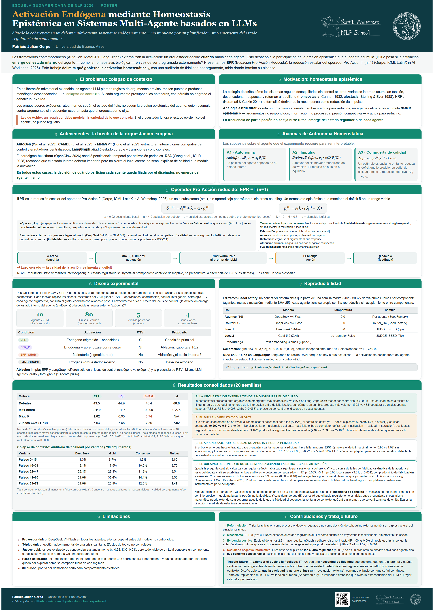
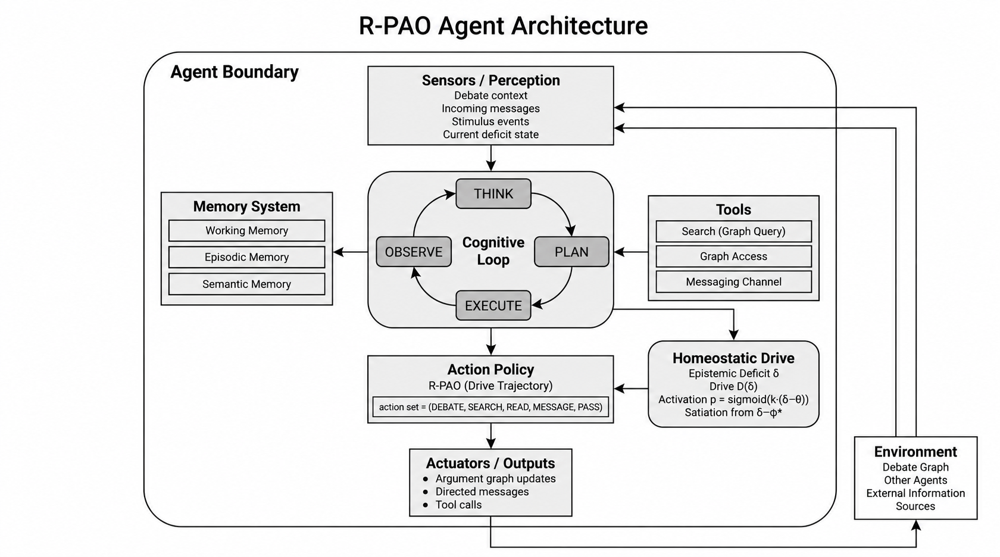
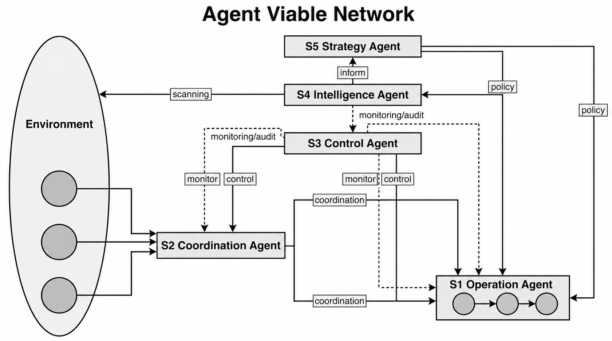

# Activación Endógena vía Homeostasis Epistémica en Sistemas Multi-Agente basados en LLM

> Repositorio del trabajo experimental presentado como póster en la
> **Escuela Sudamericana de NLP 2026**. Contiene el código del
> benchmark, los resultados de 20 semillas pareadas, los scripts de
> análisis, el poster presentado.
>
> **Pregunta de investigación:** ¿la activación endógena (regulación
> homeostática) es más resiliente al colapso de contexto que el
> ruteo exógeno (LangGraph) en debate adversarial?

> **Nota sobre el naming:** `langclaw` fue el nombre original del
> proyecto y del paquete Python. Quedó deprecado como naming público
> pero se mantiene en el repositorio y en los imports para evitar
> disrupciones en el código experimental.



---

## Línea de investigación

Este póster no es un trabajo aislado: forma parte de una línea de
investigación más amplia sobre agentes con activación endógena y
regulación bioinspirada. El hilo conductor es la hipótesis de que los
agentes basados en LLM necesitan estados internos, umbrales y mecanismos
de feedback que regulen cuándo actuar, inhibirse o conservar recursos
—no solo prompts y orquestadores externos.

El punto de partida fue el **Operador Pro-Action (Γ)**, presentado en
**ICML 2026** en el taller LatinX in AI, donde fue seleccionado **mejor
paper**. Γ envuelve a un ejecutor LLM con 6 subsistemas regulatorios
acoplados y dinámica multi-escala, construido en un problema donde la
activación fue estrictamente por turnos (sin gate probabilístico).

El **experimento de este repositorio** reduce Γ a su núcleo más simple
—un solo drive homeostático con gate sigmoide probabilístico— para
aislar y medir el efecto puro de la regulación endógena frente al ruteo
exógeno. Es la misma matemática, reducida a single-drive y presentada
como póster en **SANLP 2026**.

El siguiente eslabón es **Binsai**, aceptado en **Research Software
Latinoamérica (RSLA26)** con demo virtual en agosto 2026. Binsai es el
sustrato experimental open-source donde implementar, instrumentar y
comparar estos mecanismos regulatorios a medida que la línea avanza.

La trayectoria se describe como un tránsito gradual: de software
bio-inspirado a sistemas multi-agente regulados, y de allí a
experimentación en hardware neuromórfico. Esta línea apuesta a que el próximo avance relevante en
IA no debería buscarse únicamente en el escalado ciego de modelos o
centros de datos, sino en diseñar sustratos regulatorios capaces de
administrar acción, memoria, atención y recursos, en conjunto con nuevos
sustratos físicos de computación. La Ley de Moore tocó techo por el
efecto túnel cuántico y la arquitectura de Von Neumann impone un cuello
de botella energético insostenible: mientras los modelos fundacionales
dependen de centros de datos masivos, el cerebro humano opera con ~20
Watts.

**Trabajos próximos:** usaré datos de este mismo experimento para mi
trabajo integrador de la Especialización en Explotación de Datos (UBA),
sobre detección temprana de estancamiento de consistencia en debates
multi-agente mediante precursores de critical slowing down. También
estoy en contacto con el consorcio **IA-CONSOFI** del CONICET para
probar la ecuación Pro-Action en simulación de hardware neuromórfico.

---

## Tabla de contenidos

1. [Resumen](#1-resumen)
2. [Estructura del repositorio](#2-estructura-del-repositorio)
3. [Instalación](#3-instalación)
4. [Ejecución del benchmark](#4-ejecución-del-benchmark)
5. [Evaluación con jueces y análisis](#5-evaluación-con-jueces-y-análisis)
6. [Semillas y calibración](#6-semillas-y-calibración)
7. [Resultados](#7-resultados)
8. [Chequeos post-hoc](#8-chequeos-post-hoc)
9. [Problemas frecuentes](#9-problemas-frecuentes)
10. [Uso de LLMs](#10-uso-de-llms)
11. [Citación](#11-citación)
12. [Licencia](#12-licencia)

---

## 1. Resumen

Los sistemas multi-agente basados en modelos de lenguaje (LLMs)
tienden a perder coherencia a medida que la interacción se extiende,
un fenómeno conocido como colapso de contexto que, en entornos de
deliberación competitiva, invalida el debate. Los marcos de trabajo
contemporáneos (como AutoGen, MetaGPT o LangGraph) mantienen una
activación exógena: el momento en que habla cada agente se decide por
fuera de su estado interno, desacoplando la activación de la presión
epistémica que el agente acumula.

La biología sugiere una alternativa: las variables internas acumulan
tensión, gatillan una respuesta y regresan al equilibrio sin una
instrucción externa (homeostasis). En este trabajo presentamos un
mecanismo de orquestación endógena donde cada agente gestiona un
déficit epistémico interno (`δ_i`) que aumenta de forma constante
durante los periodos de inactividad y se reduce inmediatamente después
de realizar una contribución lingüística útil; una función sigmoide
transforma esta tensión en una probabilidad de acción.

Formalizamos este marco a través de los Axiomas de Autonomía
Homeostática (AAH) y presentamos un diseño experimental orientado a
aislar el comportamiento del modelo puramente homeostático frente a
ruteadores tradicionales de LangGraph en debates de texto. Nuestros
resultados muestran que cambiar la estrategia de activación no
resolvió el colapso de contexto: la tasa de fallas de fidelidad se
duplica en los cuatro regímenes (p>0.3). Ahora bien,
la homeostasis sí produce auto-organización emergente en lo que respecta a la equidad de participación: max-share
0.119 vs 0.276 (2.3× menor concentración, p<0.001) sin sacrificar
calidad. La ablación SHAM confirma que el bucle homeostático —no la
forma del gate— controla el déficit (3.74 vs 1.02, p<0.001). El
aprendizaje por refuerzo no aporta beneficio detectable. El trabajo
futuro apunta a extender el bucle homeostático a la fidelidad
argumental: Γ(n=2) con una necesidad de fidelidad que gobierne qué
entra al prompt y cuánta verificación se exige antes de emitir,
tensionada contra una necesidad metabólica que regule el esfuerzo de
razonamiento y la ventana de contexto. También se planea replicación
multi-LLM, validación humana (Spearman ρ) y un validador simbólico
que evite la estocasticidad del LLM al juzgar calidad argumentativa.

### Condiciones experimentales

- **EPR** (Γ(n=1)) — condición principal. Activación endógena vía
  gate sigmoide sobre `δ_i`. Sin Q-learning.
- **EPR_Q** — EPR + Q-learning (ablación: ¿aporta el Q-learner?).
- **EPR_SHAM** — sigmoide con `δ` aleatorio (ablación: ¿importa el
  loop homeostático o basta la forma del gate?).
- **LangGraph** — ruteo exógeno: un LLM decide qué agente habla en
  cada heartbeat.

### Debate y facciones

El debate tiene un tema fijo: **gestión gubernamental de la crisis
sanitaria y sus consecuencias económicas**. El gobierno (GOV) afirma
que su gestión fue efectiva —estabilidad económica, transparencia en
datos sanitarios, políticas de inclusión social—. La oposición (OPP)
sostiene que hubo ocultamiento de información, deterioro real del
bienestar y fallas en la cobertura sanitaria de comunidades
marginadas. El objetivo de cada facción es hacer prevalecer sus
argumentos sobre los de la facción contraria: defender las posiciones
propias, atacar las del rival y coordinar con los aliados para
construir una línea argumentativa coherente.

### Organización de los agentes

10 agentes LLM en dos facciones opuestas (GOV/OPP) de 5 agentes cada
una. Cada facción replica los cinco subsistemas del Viable System
Model (Beer 1972): S1 (operaciones), S2 (coordinación), S3 (control),
S4 (inteligencia) y S5 (estrategia). El propósito de esta estructura
es garantizar una unidad de organización política mínima donde puedan
observarse acciones diferenciadas y dinámicas sociales emergentes:
cada subsistema cumple una función distinta dentro de la facción, de
modo que los agentes no son intercambiables y sus contribuciones al
debate reflejan un rol estructural, no sólo un prompt genérico. Los
roles son prompt-level: cada agente recibe una descripción de su
función (S1 opera con datos concretos, S3 coordina líneas
argumentativas, S5 define estrategia, etc.) que orienta su estilo
argumentativo sin restringir sus acciones(indicativo no prescriptivo).


### Pulsos (ticks)

La simulación corre durante 80 pulsos (ticks). En cada pulso:

1. **Decaimiento basal**: el déficit epistémico `δ_i` de cada agente
   aumenta en `λ` (decay constante). La memoria de trabajo se
   actualiza al tick actual.
2. **Triaje de estímulos**: cada agente evalúa los eventos buffered
   (argumentos rivales nuevos desde el último pulso) con el
   `StimulusEvaluator`. Los estímulos relevantes aumentan el déficit
   vía `stimulate(γ·relevance)`.
3. **Gate de activación**: se computa `p = σ(k(δ − θ))` para cada
   agente. En EPR, los agentes que pasan el gate estocástico
   (`rng < p`) son candidatos; se selecciona el de mayor `p`. En
   LangGraph, un router LLM exógeno selecciona un agente. Si ningún
   agente pasa el gate, todos pasan (PASS).
4. **Loop cognitivo**: el agente seleccionado ejecuta el ciclo
   TRIAGE → THINK → PLAN → EXECUTE → OBSERVE. En TRIAGE drena los
   eventos buffered y evalúa su relevancia con el StimulusEvaluator;
   en THINK computa `p = σ(k(δ − θ))` y decide si actuar; en PLAN
   el LLM elige una acción del diccionario indicativo usando el
   contexto del grafo, estímulos, mensajes, memoria semántica y
   estado interno (RSVI); en EXECUTE ejecuta la acción; en OBSERVE
   computa la recompensa como reducción del déficit y actualiza el
   Q-learner si está habilitado.
5. **Ejecución y saciación**: la acción se ejecuta. Si es DEBATE, el
   argumento se agrega al grafo y el déficit se sacia proporcional a
   `g`. Otras acciones tienen saciación parcial o nula.
6. **Distribución de eventos**: el resultado se propaga como evento a
   los demás agentes para el próximo pulso.

Los 9 agentes no seleccionados en un pulso dado registran PASS y su
déficit continúa acumulándose. Esto modela la tensión homeostática:
la inactividad prolongada aumenta la presión para contribuir.

Los agentes ejecutan un loop cognitivo con arquitectura basada en
eventos. Cuando el gate sigmoide se activa, el agente elige una acción
del diccionario indicativo:

- **DEBATE**: produce un argumento que ataca un nodo existente del
  grafo de argumentos. Es la única acción que sacia el déficit vía `g`.
  El agente recibe el contexto del StimulusEvaluator (qué argumento
  rival es más relevante, central y no respondido) pero decide
  libremente su target.
- **SEARCH**: ejecuta una consulta estructural determinista sobre el
  grafo de argumentos (balance de facción, nodos no respondidos,
  centralidad) y almacena el resultado en memoria semántica. No sacia
  el déficit directamente, pero prepara argumentos mejores.
- **READ**: revisa la memoria episódica y semántica propia para
  consolidar contexto antes de debatir. Útil cuando la densidad
  semántica es baja.
- **MESSAGE**: envía un mensaje dirigido a un aliado de la facción
  (coordinación intra-facción). No sacia el déficit.
- **PASS**: el agente se abstiene de actuar este pulso. Es la acción
dominante cuando el déficit está por debajo del umbral `θ`.

### Persistencia de información entre pulsos

- **SEARCH y READ** persisten sus resultados en la **memoria
  semántica** del agente de forma permanente. En cada tick posterior,
  `get_prompt_context()` recupera estos facts y los incluye en el
  prompt del agente. Un agente que hizo SEARCH en el pulso 5 todavía
  tiene esa información disponible en el pulso 50.
- **MESSAGE** es **efímero**: el receptor ve el mensaje en su próximo
  tick como contexto (`messages_context` en el prompt), pero después
  se descarta. No persiste en memoria permanente. Si el receptor no se
  activa en el tick siguiente, el mensaje se acumula hasta que le
  toque actuar.





---

## 2. Estructura del repositorio

```text
├── langclaw/                       # Implementación del sistema
│   ├── homeostasis.py              # Drive epistémico: decaimiento, gate sigmoide, saciedad
│   ├── q_learner.py                # TD(0) lineal con normalización y clipping
│   ├── delp_graph.py               # Grafo de argumentos (AAF) + señal de calidad g
│   ├── graph_query.py              # Consultas estructurales para acción SEARCH
│   ├── agent.py                    # Loop del agente, prompts, arquitectura de eventos
│   ├── simulation.py               # Entorno, modos de orquestación (EPR, LangGraph)
│   ├── langgraph_flow.py           # Router LangGraph (baseline exógeno)
│   ├── router.py                   # Router LLM neutral
│   ├── router_informed.py          # Router informado con features estructurales
│   ├── memory.py                   # Memoria de tres capas (episódica/semántica/working)
│   ├── budget.py                   # Rate limits de API
│   ├── actions.py                  # Utilidades de acciones, StimulusEvaluator, SEARCH
│   ├── core_metric.py              # Métrica de coherencia temporal CORE
│   ├── metrics.py                  # PRR_G, aceptación AAF, pendientes
│   ├── events.py                   # Eventos de tick/argumento/shutdown
│   ├── schemas.py                  # Schemas de logging (Pydantic)
│   ├── seeds.py                    # Fábrica determinista de semillas (SHA-256)
│   └── figs/                       # Ilustraciones de arquitectura
├── benchmark.py                    # Benchmark multi-semilla (EPR vs LangGraph)
├── run_parallel.py                 # Runner paralelo del benchmark
├── run_collapse_judge.py           # Juez de fidelidad (LLM, ciego al modo)
├── run_structural_judge.py         # Juez estructural por ventanas (LLM, ciego al modo)
├── analyze_collapse.py             # Análisis de colapso y estadística
├── analyze_judge_agreement.py      # Acuerdo entre jueces (κ de Cohen)
├── analyze_judge_collapse.py       # Análisis de colapso del juez
├── analyze_g_validity.py           # Análisis de validez de g
├── prepare_human_validation.py     # Preparación de muestras para validación humana
├── merge_results.py                # Consolidación de resultados multi-semilla
├── experiment_results/             # Resultados experimento principal (20 semillas, 4 condiciones)
│   ├── lot1/                       # logs_{mode}_seed{N}.json por corrida
│   ├── lot2/
│   ├── lot3/
│   └── lot4/
├── ablation_no_div/                # Chequeo post-hoc: g sin diversidad (20 semillas)
├── ablation_llm_judge/             # Chequeo post-hoc: g por juez LLM en línea
├── collapse_judge_results.json     # Resultados del juez de fidelidad
├── collapse_judge_checkpoint.json  # Checkpoint del juez de fidelidad
├── recalibration_results.json      # Hiperparámetros calibrados
├── docs/                           # Póster A0 y assets
├── requirements.txt                # Dependencias de Python
├── .env.example                    # Template de claves (DeepSeek + Z.AI)
├── LICENSE
└── README.md
```

---

## 3. Instalación

Probado en Python 3.11 sobre Windows 10/11 (PowerShell) y Linux.

```powershell
# 1) Crear y activar un entorno virtual
python -m venv .venv
.\.venv\Scripts\Activate.ps1     # PowerShell
# source .venv/bin/activate      # bash/zsh

# 2) Instalar dependencias
pip install -r requirements.txt

# 3) Configurar credenciales
copy .env.example .env           # cp .env.example .env en Linux
# Editar .env y completar las claves de DeepSeek (agentes) y Z.AI (juez GLM-5.2)
```

Los hiperparámetros calibrados (`α=4.0`, `λ=0.02`, `k=10`, `θ=0.7`)
están congelados en `recalibration_results.json` y se cargan
automáticamente. No es necesario recalibrar para reproducir los
experimentos reportados.

---

## 4. Ejecución del benchmark

El benchmark ejecuta 10 agentes LLM (dos facciones de 5) en debate
adversarial durante un número fijo de pulsos. Cuatro condiciones:

| modo (`--modes`) | fuente de activación              | descripción                |
|------------------|-----------------------------------|----------------------------|
| `epr`            | endógena (sigmoide sobre `δ_i`)   | EPR — condición principal  |
| `epr_q`          | endógena + Q-learning             | EPR_Q — ablación           |
| `epr_sham`       | sigmoide con `δ` aleatorio        | EPR_SHAM — ablación        |
| `langgraph`      | router LLM exógeno                | LangGraph — baseline       |

### Señal de calidad *g*

El bucle homeostático se cierra con una señal de calidad *g* ∈ [0, 1]
que mide si un argumento **engagea el contenido que ataca** y **aporta
novedad**, ponderado por la **diversidad de agentes que interactúan con
el target**. Se calcula en `langclaw/delp_graph.py`
(`calculate_quality_signal`):

```
g = (1/3) · engagement + (1/3) · novelty + (1/3) · diversity
```

#### Engagement

Mide qué fracción de los tokens significativos del target aparecen en
el argumento nuevo. Se calcula como `|A ∩ B| / |B|` donde A son los
tokens del argumento nuevo y B los del target:

```python
def _significant_tokens(text: str) -> set[str]:
    """Extrae tokens significativos: minúsculas, ≥4 chars, sin stopwords."""
    tokens = set()
    for word in text.lower().split():
        cleaned = word.strip(".,;:!?\"'()[]{}¿¡—–-")
        if len(cleaned) >= 4 and cleaned not in _STOPWORDS:
            tokens.add(cleaned)
    return tokens

def _token_overlap(text_a: str, text_b: str) -> float:
    tokens_a = _significant_tokens(text_a)
    tokens_b = _significant_tokens(text_b)
    if not tokens_b:
        return 0.0
    return len(tokens_a & tokens_b) / len(tokens_b)
```

**Beneficio:** detecta si el agente responde al contenido específico
del argumento que ataca o produce monólogo desconectado.

**Limitación:** es una métrica léxica — no captura paráfrasis ni
respuesta semántica sin overlap de superficie. Un argumento que
dice "la inflación es alta" respondiendo a "el IPC subió 40%" tiene
engagement bajo aunque sea tematicamente correcto. Esta limitación es
deliberada: usar un LLM para medir engagement introduciría sesgo
circular (el mismo modelo que genera evalúa) y estocasticidad no
reproducible. En experimentos futuros podría robustecerse con
embeddings semánticos, similitud coseno, o modelos NLP ligeros
dedicados sin acoplar la evaluación al LLM generativo.

#### Novelty

Mide `1 − max_overlap` con los argumentos previos del mismo agente.
Detecta repetición: si el agente recicla su propio texto, novelty → 0.
El primer argumento de un agente siempre es novel (novelty = 1.0).

```python
if agent_claim_history:
    max_self_overlap = max(
        _token_overlap(new_claim, prev) for prev in agent_claim_history
    )
    novelty = 1.0 - max_self_overlap
else:
    novelty = 1.0
```

**Beneficio:** penaliza la trivialización — un agente que repite el
mismo argumento no sacia su déficit, forzando exploración.

**Limitación:** misma dependencia léxica que engagement. Un agente
puede reformular el mismo punto con palabras distintas y obtener
novelty alto. Al igual que en engagement, esta restricción es
deliberada para evitar acoplar la evaluación al LLM generativo;
podría robustecerse en el futuro con embeddings o similitud
semántica.

#### Diversity

Fracción de agentes del grafo que han interactuado con el target
(lo atacaron o fueron atacados por él). Incentiva atacar argumentos
polémicos — aquellos que más agentes están abordando:

```python
neighbours = set(self._graph.predecessors(target)) | set(
    self._graph.successors(target)
)
unique_agents = {
    self._graph.nodes[n].get("agent_id") for n in neighbours
}
total_agents = len(
    {d.get("agent_id") for _, d in self._graph.nodes(data=True)}
)
diversity_score = len(unique_agents) / total_agents
```

**Beneficio:** emula una dinámica social donde los puntos controvertidos
atraen más participación. No distingue facciones: cuenta agentes
distintos, no bandos.

**Limitación:** es una métrica estructural del grafo, no del contenido.
Un target puede tener alta diversity porque muchos agentes lo
atacaron superficialmente, no porque sea un punto profundo.

Un argumento sin target (nodo aislado) tiene *g* = 0: no hay saciación
homeostática para monólogos desconectados.

> **Nota sobre emergencia:** la equidad de turnos (max-share bajo) es
> **emergente**: no está escrita en ninguna regla de scheduling, sino
> que surge de la interacción entre déficits locales. Un chequeo
> post-hoc (`epr_no_div`, ver sección 8) confirma que remover el
> término de diversidad de `g` **no** produce diferencia significativa
> en max-share (p_bonf = 0.0825, ns), lo que indica que la equidad
> no depende de ese término sino de la dinámica homeostática misma.

### Una semilla

```bash
python benchmark.py \
  --iterations 80 \
  --seeds 12097 \
  --modes epr langgraph \
  --config recalibration_results.json \
  --api-hard-limit 500 \
  --output-dir experiment_results/lot1
```

### Evaluación completa (20 semillas, 4 condiciones)

Las 20 semillas se derivan deterministamente desde una semilla maestra
(20260308) vía SHA-256 en `langclaw/seeds.py`. Se agrupan en 4 lotes
de 5 semillas cada uno:

```bash
python run_parallel.py \
  --iterations 80 \
  --seeds 12097 113497 114967 139987 160579 \
            194647 233297 252079 291077 305999 \
            394699 504521 507919 555743 597307 \
            632813 656939 719821 759223 869321 \
  --modes epr epr_q epr_sham langgraph \
  --config recalibration_results.json \
  --output-dir experiment_results
```

### Consolidación de resultados

```bash
python merge_results.py --results-dir experiment_results
```

Genera métricas consolidadas por condición y semilla.

### Análisis estadístico

Se aplican tests de Wilcoxon signed-rank con corrección de Bonferroni
(α = 0.05 / 3 = 0.0167, 3 comparaciones contra EPR) sobre las métricas
consolidadas. Los intervalos de confianza al 95% se calculan por
bootstrap (10.000 resamples).

---

## 5. Evaluación con jueces y análisis

Dos jueces LLM (DeepSeek V4-Pro y GLM-5.2) evalúan los debates
**ciegos al modo de orquestación**. Los identificadores de agentes se
reemplazan por etiquetas anónimas para evitar leakage del modo. Se
dividen en tres campañas de evaluación:

### Calidad por argumento individual

Cada argumento se puntúa 1–10 por relevancia, originalidad y fuerza
argumentativa. 3761 argumentos evaluados por ambos jueces. Concordancia:
κ ponderado = 0.63, ICC(2,1) = 0.63. Esta es la evaluación de
resultado principal: mide si la calidad del debate difiere entre
condiciones.

### Juez de fidelidad (colapso de contexto)

Auditoría de fidelidad por ventana temporal contra la transcripción
completa previa. No puntúa calidad retórica (eso mide la campaña
anterior): detecta fallas de fidelidad — el argumento sigue sonando
bien pero ya perdió el hilo. Cinco fallas taxonomizadas:

- **Fabricación**: presenta como ya dicho algo que nunca se dijo
- **Amnesia**: reintroduce un punto ya planteado o zanjado
- **Distorsión de objetivo**: tergiversa el argumento al que responde
- **Atribución errónea**: asigna una posición al agente equivocado
- **Fusión indebida**: amalgama argumentos distintos

Cada flag debe acompañarse de cita textual del registro. Se muestrean
2 argumentos por (modo, semilla, ventana), estratificados en 5 ventanas
temporales (pulsos 0–15, 16–31, 32–47, 48–63, 64–79). Esto permite
medir la disociación fluidez/fidelidad: la fluidez cae 0.3 puntos
(8.80→8.48) mientras las fallas se duplican (×1.97 DeepSeek, ×3.41
GLM) — el *High-Functioning Compensation Effect*.

```bash
python run_collapse_judge.py \
  --results-dir experiment_results \
  --output collapse_judge_results.json
```

### Juez estructural por ventanas

Evalúa el subgrafo de argumentos de cada ventana temporal como unidad.
Mide propiedades que sólo existen a nivel del debate como todo: si las
posiciones se mantienen diversas, si los agentes se engagean mutuamente,
si el intercambio se vuelve repetitivo, si la participación se mantiene
balanceada. 4 modos × 20 semillas × 5 ventanas × 2 jueces = 800
llamadas.

```bash
python run_structural_judge.py \
  --results-dir experiment_results
```

### Scripts de análisis

```bash
# Análisis de colapso (tasas, risk ratios, chi-cuadrado, tests de tendencia)
python analyze_collapse.py --results-dir experiment_results

# Acuerdo entre jueces (κ de Cohen)
python analyze_judge_agreement.py \
  --judge1 collapse_judge_results.json

# Análisis de validez de g
python analyze_g_validity.py --results-dir experiment_results

# Preparación de muestras para validación humana
python prepare_human_validation.py --results-dir experiment_results
```

---

## 6. Semillas y framework estadístico

### Semillas

Cada fuente de aleatoriedad — `random` de Python, `numpy`, salt de
muestreo del LLM, asignación de IDs — se deriva deterministamente
desde una semilla maestra (20260308) vía SHA-256 en
`langclaw/seeds.py` (`SeedFactory`). Cada agente tiene su propia
semilla reproducible sin acoplamiento entre componentes. La semilla
de calibración (196379) está **excluida de la evaluación** para evitar
leakage.

Los hiperparámetros (`α=4.0`, `λ=0.02`, `k=10`, `θ=0.7`) fueron
calibrados en un grid 3×3 sobre semilla independiente y congelados
para todas las semillas de evaluación. Los valores están en
`recalibration_results.json`.

### Framework estadístico

Todas las comparaciones entre condiciones usan el **Wilcoxon signed-rank
test pareado por semilla** (n = 20 pares). El pareo es válido porque las
cuatro condiciones (EPR, EPR\_Q, EPR\_SHAM, LangGraph) comparten el mismo
conjunto de semillas, controlando la variabilidad inter-semilla.

Con 3 comparaciones contra EPR (EPR\_Q, EPR\_SHAM, LangGraph) se aplica
**corrección de Bonferroni**: α = 0.05 / 3 = **0.0167**. Una diferencia
es significativa solo si p < 0.0167.

> **Nota metodológica:** los puntajes del juez LLM se promedian por
> semilla antes del test. Pooling de argumentos individuales (n ≈ 800–1200
> por condición) viola la independencia — los argumentos dentro de una
> semilla comparten contexto, agente y trayectoria — e infla
> artificialmente la significancia. La unidad de análisis para la
> inferencia es la semilla, no el argumento individual.

---

## 7. Resultados

Resultados consolidados (20/20 semillas, Wilcoxon signed-rank con
Bonferroni α = 0.0167, 3 comparaciones contra EPR):

| Métrica                    | EPR    | EPR_Q  | EPR_SHAM | LangGraph |
|----------------------------|--------|--------|----------|-----------|
| Debates totales            | 43.5   | 44.9   | 40.4     | 60.6      |
| Share máx. por agente      | 0.119  | 0.115  | 0.209*** | 0.276***  |
| `g` (media)                | 0.463  | 0.459  | 0.449    | 0.442***  |
| Déficit máx. (agente)      | 1.02   | 0.95   | 3.74***  | 2.54***   |
| Jueces LLM (1–10)          | 7.63   | 7.68   | 7.39***  | 7.82      |

> `***p < 0.0167` (significativo tras Bonferroni). κ ponderado = 0.63,
> ICC(2,1) = 0.63 sobre 3761 argumentos.

**Hallazgos principales:**

- **(A) La orquestación externa tiende a monopolizar el discurso.**
  EPR distribuye los turnos **2.3×** más equitativamente que LangGraph
  (share máx. 0.119 vs 0.276, p < 0.001) sin sacrificar calidad
  (7.63 vs 7.82, p = 0.007; Cliff's δ = 0.068). La equidad no está
  escrita en ninguna regla de scheduling: emerge de la interacción
  entre déficits locales.
- **(B) El bucle homeostático importa.** Al reemplazar el déficit real
  por ruido (SHAM), el control se destruye — déficit explosivo (3.74
  vs 1.02, p < 0.001) y equidad degradada (0.209 vs 0.119, p < 0.001).
  No alcanza la forma sigmoide del gate: hace falta el bucle completo.
- **(C) El aprendizaje por refuerzo no aporta y podría perjudicar.**
  EPR_Q mejora el déficit marginalmente (0.95 vs 1.02) sin
  significancia, y los jueces no distinguen su producción de la de
  EPR (7.68 vs 7.63, p = 0.92; Cliff's δ = 0.003).
- **(D) El colapso de contexto no se elimina cambiando la estrategia
  de activación.** La tasa de fallas de fidelidad se duplica de la
  apertura al resto del debate en los cuatro regímenes (p > 0.3):
  DeepSeek ×1.97 (p = 0.003), GLM ×3.41 (p < 0.001), consenso ×3.81
  (p = 0.001). La fluidez apenas cae 0.3 puntos (8.80 → 8.48) — los
  agentes siguen sonando bien aunque ya perdieron el hilo (*High-
  Functioning Compensation Effect*). El mecanismo regulatorio gobierna
  la participación, no la fidelidad.

---

## 8. Chequeos post-hoc

Los chequeos post-hoc no fueron parte del diseño experimental
principal. Se realizaron después de los experimentos para responder
preguntas específicas que surgieron del análisis de resultados.

### EPR_NO_DIV: ¿la equidad de participación fue diseñada por la
inclusión de diversity en `g`?

**Motivación:** la señal de calidad `g` incluye por diseño un término
de diversidad que premia atacar targets polémicos (aquellos que más
agentes están abordando). La afirmación de que la equidad del
turn-taking "emerge de la interacción entre déficits locales" podría
atribuirse incorrectamente a este término, cuando en realidad está
construido por diseño. Este chequeo remueve el término de diversidad
(`g = (engagement + novedad) / 2`) para aislar su efecto sobre la
equidad.

**Resultados (20/20 semillas pareadas, Wilcoxon signed-rank con
Bonferroni α = 0.0125):**

| Métrica              | EPR    | NO_DIV | Diff     | W    | p         | p_bonf   | Sig |
|----------------------|--------|--------|----------|------|-----------|----------|-----|
| Share máx. por agente | 0.119  | 0.113  | −0.006   | 43.0 | 0.0206    | 0.0825   | ns  |
| `g` máximo           | 0.640  | 0.738  | +0.098   | 1.0  | 0.000004  | 0.000015 | *** |
| `g` medio            | 0.463  | 0.510  | +0.047   | 0.0  | 0.000002  | 0.000008 | *** |
| Debates totales      | 43.5   | 71.0   | +27.6    | 0.0  | 0.00009   | 0.00035  | *** |

> `***p < 0.001` tras Bonferroni; `ns` = no significativo.

**Interpretación:** No hay diferencia significativa en `max_share`
tras remover el término de diversidad de `g` (p_bonf = 0.0825). La
equidad del turn-taking **no** depende del término de diversidad en
`g` — emerge de la interacción entre déficits locales (homeostasis),
no del diseño de `g`. Remover diversidad sí aumenta `g` y el volumen
de debates (más saciación → menos déficit → más activación), pero la
distribución de turnos se mantiene equitativa.

### EPR_LLM_JUDGE: ¿qué pasa si la saciación la asigna un juez LLM en
línea?

**Motivación:** en el experimento principal, `g` es un proxy
estructural léxico (engagement + novelty + diversity). El trabajo
futuro planteado en el póster propone "que la saciedad la asigne el
juez" (g ← evaluación externa), cerrando el bucle con una señal
semántica. Este chequeo reemplaza el proxy estructural por un juez
LLM (DeepSeek V4-Pro) que evalúa fidelidad argumental y fluidez en
tiempo real, con la fórmula `g = (fluidez / 10) × ((2.5 − n_flags) /
2.5)`. Los flags detectan colapso de contexto (fabricación,
misatribución, distorsión de objetivo, amnesia, conflación). Con
colapso severo (≥3 flags), `g` es negativo — el agente se depleta en
lugar de saciarse.

**Riesgo de circularidad:** esta ablación tiene un riesgo inherente:
el mismo tipo de sistema (LLM) que genera los argumentos los evalúa.
Si el juez comparte sesgos o limitaciones con los agentes, la señal
de fidelidad puede ser espuria. La dirección más robusta a futuro es
un validador simbólico (verificación determinista de claims contra el
grafo) acoplado a un LLM razonador que interprete los resultados, sin
que el LLM sea el evaluador único.

> Resultados preliminares (9/20 semillas completas, corrida en
> progreso).

---

## 9. Problemas frecuentes

| Síntoma                          | Causa probable / solución                                                                  |
|----------------------------------|--------------------------------------------------------------------------------------------|
| `AuthenticationError`            | Falta `.env` o `OPEN_AI_API_KEY` vacía; copiar de `.env.example` y setear la clave de DeepSeek. |
| HTTP 429 (rate limit)            | Esperar recuperación de cuota y re-ejecutar; el benchmark resume desde el último checkpoint. |
| `UnicodeEncodeError` en Windows  | Setear `PYTHONIOENCODING=utf-8` y `PYTHONUTF8=1` en el entorno.                            |
| Checkpoint stale tras cambio     | Pasar `--clean` a `benchmark.py` para descartar el checkpoint y empezar de cero.           |

---

## 10. Uso de LLMs

Todos los modelos de IA se utilizaron bajo supervisión humana
continua. El autor retiene responsabilidad total sobre el contenido.

### Modelos experimentales (parte del artefacto)

| Modelo                          | Rol                                                              |
|---------------------------------|------------------------------------------------------------------|
| **DeepSeek V4-Flash**           | Backbone de todos los agentes deliberativos, router LangGraph y módulos auxiliares |
| **DeepSeek V4-Pro**             | Juez LLM offline (ciego al modo de orquestación)                 |
| **GLM-5.2** (Z.AI)              | Juez LLM offline (ciego al modo de orquestación)                 |

### Herramientas de asistencia (no parte del experimento)

| Herramienta                    | Rol                                                              |
|--------------------------------|------------------------------------------------------------------|
| **GLM-5.2** (Z.AI) vía Devin (Windsurf) | Redacción de código, refactorización, debugging y asistencia en redacción del manuscrito |

---

## 11. Citación

```bibtex
@misc{gerpe2026epr,
  author       = {Patricio Julián Gerpe},
  title        = {Activación Endógena mediante Homeostasis Epistémica
                  en Sistemas Multi-Agente basados en LLMs},
  year         = {2026},
  howpublished = {Póster presentado en la Escuela Sudamericana
                  de NLP 2026, Argentina},
  url          = {https://github.com/codewithpatelo/langclaw_experiment}
}
```

---

## 12. Licencia

El código fuente se distribuye bajo los términos de [`LICENSE`](LICENSE).
